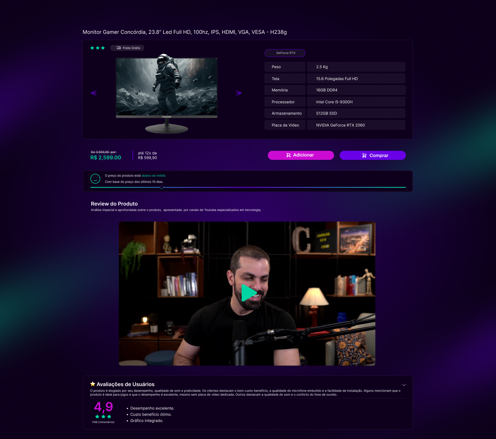
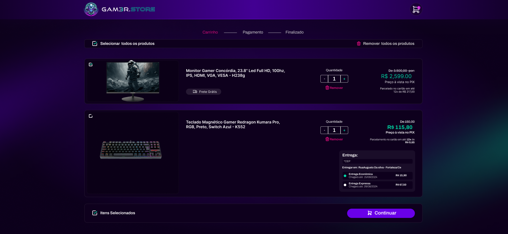
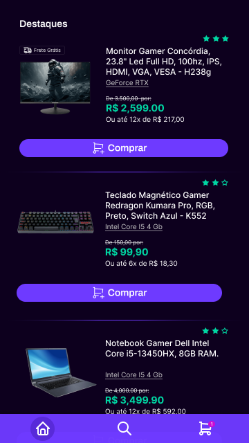
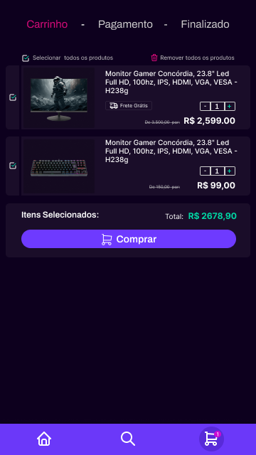

# 🎮 **Gam3r Store** - Seu Paraíso de Games!

_Bem-vindo ao repositório do **Gam3r Store**, uma aplicação Fullstack de e-commerce feita para gamers de verdade! 🕹️_

<p align="center">
  
</p>

---

## 📦 **Sobre o Projeto**
A **Gam3r Store** é uma loja online onde você pode comprar tudo relacionado a games, desde consoles até periféricos de última geração. Este projeto foi desenvolvido para o meu portfólio pessoal e abrange toda a stack: backend, frontend, core e mobile, com uma arquitetura pensada para ser modular e flexível.

Aqui está o que você vai encontrar neste projeto:

- 🚀 **Backend:** API robusta construída para gerenciar produtos, usuários e pedidos.
- 🎨 **Frontend:** Uma interface elegante e intuitiva desenvolvida para uma ótima experiência do usuário.
- 📱 **Mobile:** Experiência de compra mobile-first com o app Gam3r Store.
- 🛠️ **Core (em `packages/core`):** As regras de negócio e a lógica da aplicação estão separadas das tecnologias e ferramentas, garantindo flexibilidade e independência de frameworks.

---

## 🏗 **Monorepo com Turborepo**

Este projeto utiliza o **Turborepo** para gerenciar múltiplos pacotes e aplicações no mesmo repositório.

### **Apps e Pacotes:**

- **backend:** API construída com Node.js
- **frontend:** Aplicação web usando React
- **mobile:** Aplicação mobile usando React Native
- **@gam3r/core:** Pacote que contém as regras de negócio
- **@gam3r/eslint-config:** Configurações do eslint compartilhadas
- **@gam3r/typescript-config:** Arquivos de configuração do TypeScript

---

## 🚀 **Como rodar o projeto**

### Pré-requisitos:
- Node.js (v14+)
- Yarn ou NPM

### Passo a passo:
1. Clone o repositório:
```bash
git clone https://github.com/ThiagoLahass/gam3r-store-ecommerce-fullstack-application.git
```

2. Acesse o diretório do projeto e instale as dependências:
```bash
cd gam3r-store
yarn install
```

3. Configure as variáveis de ambiente com o seu `.env`:
```bash
cp .env.example .env
```

4. Rode a aplicação (use *TurboRepo* para monorepos):
```bash
yarn turbo run dev
```

### Build
Para construir todos os pacotes e aplicações:
```bash
yarn turbo run build
```

### Develop
Para rodar em ambiente de desenvolvimento:
```bash
yarn turbo run dev
```

## 🛠️ **Tecnologias utilizadas**

- **Backend:** [Nest], [PostgreSQL], [Prisma]
- **Frontend:** [React], [Next], [TailwindCSS]
- **Mobile:** [React-Native], [Expo]
- **Core:** Regras de negócio desacopladas, seguindo boas práticas de arquitetura
- **Monorepo:** Turborepo

## 📱 **Mockups e Design**
Para uma prévia da aplicação, confira os mockups no Figma, do projeto [Web](https://www.figma.com/design/0YkvCVWX1JNokdsHlufqyR/Gam3rStore?node-id=0-1&t=ByqB0jN0VRF4Sw6u-1) e também do projeto [Mobile](https://www.figma.com/design/2KkR2QqezLQn5FPa7gaoUB/Gam3rStore---Mobile?t=PMsmr7TGbliPr8T3-1) ou veja abaixo:

<div style="display: flex; flex-direction: column; justify-content: center; gap: 40px">
  
  <div style="display: flex; flex-direction: column; justify-content: center; gap: 20px; text-align: center;">
    <p class="font-bold text-emerald-500">Página Web sobre Informações do Produto</p>
    <div style="display: flex; justify-content: center; margin: 20px">
        
    </div>
  </div>

  <div style="display: flex; flex-direction: column; justify-content: center; gap: 20px; text-align: center;"> 
    <p class="font-bold text-emerald-500">Página Web do Carrinho do Usuário</p>
    <div style="display: flex; justify-content: center; margin: 20px">
        
    </div>
  </div>

  <div style="display: flex; flex-direction: column; justify-content: center; gap: 20px; text-align: center;">
    <p class="font-bold text-emerald-500">Home e Carrinho, respectivamente, da aplicação Mobile</p>
    <div style="display: flex; justify-content: space-around; align-items: center; height: 300px; width: 100%;">
        
        
    </div>
  </div>

</div>


## 🤝 **Contribuindo**
Contribuições são bem-vindas! Sinta-se à vontade para abrir um **pull request** ou sugerir melhorias via **issues**.